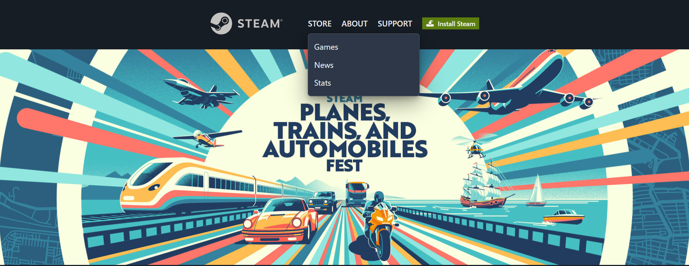
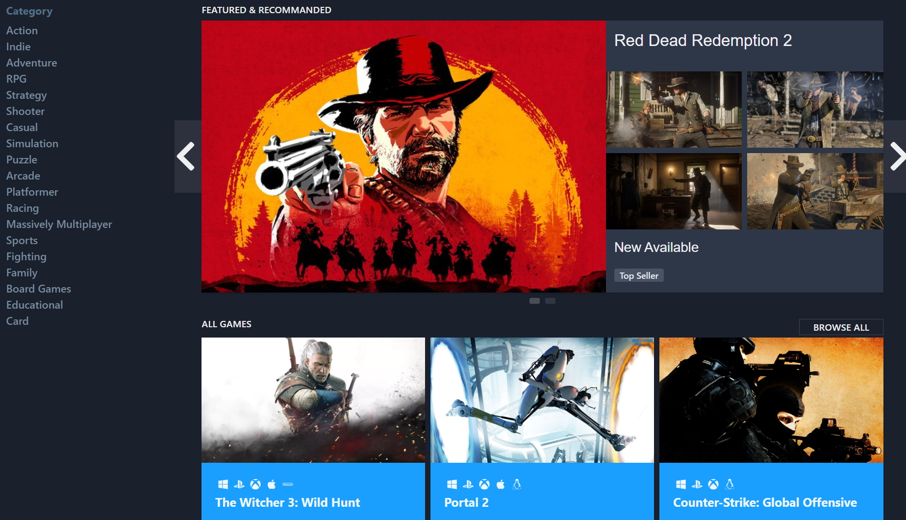
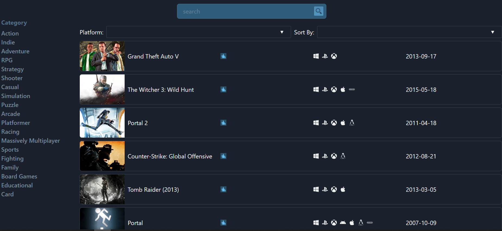
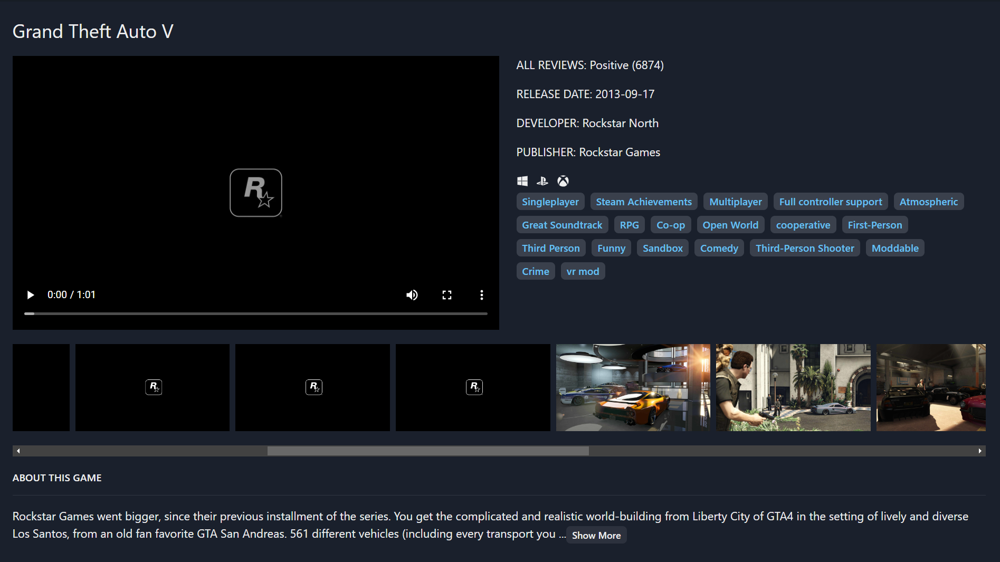

# Download Project

You can download this project by git clone

    git clone https://github.com/beginnerstrongermaster/steam-clone.git

Or, you can download ZIP and extract it by yourself

# Demo

[Check here](https://ultimate-steam-clone.top/) to experience the real website

# API

This Project is using [Rawg API](https://rawg.io/apidocs)

# Home Page

## Header and Event

### Header

Global Header contains three parts: **Logo**, **Menus** and **Install Steam** button

- Click **Logo**, you will be redirected to the Home page

- **Store** menu has three options: Games, News and Stats

  1.  **Games** will lead you to the [Game List](README.md#game-list)

  2.  **News** and **Stats** will lead you to the corresponding official Steam page

- **About**, **Support**, **Install Steam Button** will lead you to the official pages

### Event

Click on the event will lead you to the official event page

### Main Content and Side Bar

### Side Bar

Side Bar contains **categories**, you can select them and see the games filtered with the cate you selected

### Featured Games

Featured games is a Steam-like carousel

### All Games

All games is a card group that shows some games, if you want to browse all games, you can click <b>BROWSE ALL</b> at the top right

# Game List

## Search Bar

Search the game through the Search Bar

**Notice: Search will clean out the selected category and filters**

## Selectors

You can filter games by **Platform** and **Sort Order** selectors

## Game List Item

Click game items to see the detail

# Game Detail

## Game Summary

You can see Game Summary at the right side

## Media display

The media will be displayed at the left side of the game summary

## Media Bar

You can select the media you want to display

## Description

The description of the game
